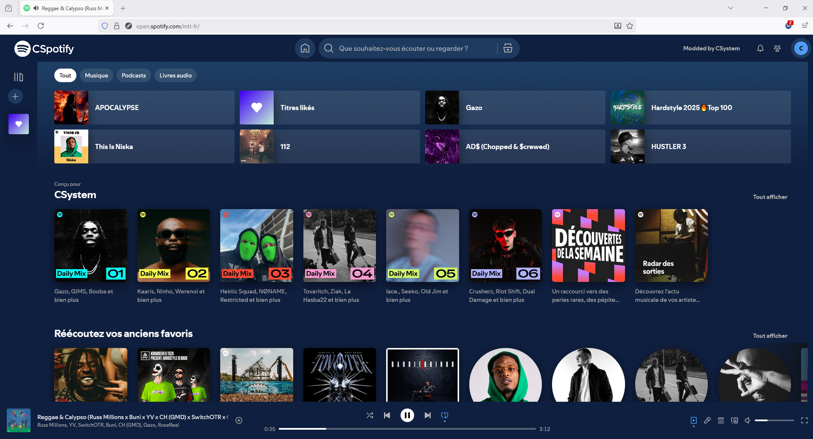

# CSpotify

CSpotify est une extension pour Mozilla (Firefox et Firefox Android) qui vous permet de profiter des avantages d'un abonnement Spotify Premium tout en offrant une interface personnalisée. Cette extension propose un thème agréable et s'adapte parfaitement aux plateformes croisées (Cross-Platform). Vous pouvez ainsi profiter de toutes les fonctionnalités premium de Spotify comme l'écoute sans publicité, la gestion de vos playlists, et bien plus directement depuis votre navigateur, que ce soit sur ordinateur ou mobile (Android).

## Comment Installer sur Mozilla (Windows, Mac & Linux)

Si vous souhaitez installer votre extension CSpotify.zip (ou toute autre extension compressée) sur Mozilla Firefox en mode débogage, voici un tutoriel détaillé pour le faire. Ce processus vous permet de tester et de déboguer l'extension directement depuis le fichier ZIP.

### Tuto : Installer une extension à partir d'un fichier .zip en mode débogage sur Mozilla Firefox

#### 1. Préparer le fichier ZIP

Assurez-vous que votre fichier CSpotify.zip contient tous les fichiers nécessaires pour l'extension, y compris le fichier manifest.json et les autres ressources de l'extension.

#### 2. Ouvrir Firefox en mode développement

- Ouvrez Mozilla Firefox sur votre ordinateur.
- Tapez `about:debugging` dans la barre d'adresse et appuyez sur Entrée. Cela vous mènera à la page de gestion des extensions en mode développement.

#### 3. Accéder à l'option "Charger l'extension temporaire"

- Sur la page `about:debugging`, dans le menu de gauche, cliquez sur "Ce Firefox" ou "This Firefox" (en fonction de la langue de votre navigateur).
- Cliquez ensuite sur le bouton "Charger un module complémentaire temporaire" ou "Load Temporary Add-on" en haut de la page.

#### 4. Sélectionner le fichier ZIP de l'extension

- Une fenêtre d'explorateur de fichiers va s'ouvrir. Vous devez sélectionner votre fichier CSpotify.zip.
- **Important** : Vous n'avez pas besoin de décompresser le fichier ZIP. Firefox peut directement charger une extension à partir du fichier .zip contenant les fichiers nécessaires.
- Sélectionnez simplement le fichier CSpotify.zip et cliquez sur "Ouvrir".

#### 5. L'extension est maintenant installée

- Firefox va installer l'extension directement depuis le fichier ZIP. Vous devriez voir un message indiquant que l'extension a bien été ajoutée en mode débogage.
- Si tout s'est bien passé et que l'extension est installée, tu devrais maintenant voir le logo "CSpotify" à la place du logo habituel de Spotify sur le site open.spotify.com.

## Comment Installer sur Firefox Android

### Tuto : Installer une extension à partir d'un fichier .zip en mode débogage sur Firefox Android

#### 1. Ouvrir Firefox Android

- Lancez l'application Firefox sur votre appareil Android.

#### 2. Accéder aux paramètres

- Appuyez sur les trois petits points dans le coin supérieur droit pour ouvrir le menu, puis sélectionnez Paramètres.

#### 3. Activer le mode développeur

- Dans la section des paramètres, cherchez l'option À propos de Firefox (ou About Firefox en anglais). Tapotez plusieurs fois sur le logo Firefox en haut de cette section (cela activera le mode développeur sur Firefox Android).
- **Note** : Vous devrez peut-être le faire plusieurs fois, comme un genre de "déblocage" pour activer les fonctionnalités avancées.

#### 4. Retourner aux paramètres

- Après avoir activé le mode développeur, revenez en arrière dans les paramètres.

#### 5. Installer l'extension depuis un fichier

- Vous devriez désormais voir une nouvelle option intitulée Installer une extension depuis un fichier ou un texte similaire. Tapotez dessus.

#### 6. Sélectionner le fichier .zip

- Une fenêtre de sélection de fichiers s'ouvrira. Allez dans le dossier où vous avez le fichier .zip de l'extension, sélectionnez-le (par exemple CSpotify.zip), puis appuyez sur Ouvrir.

#### 7. Extension installée

- Firefox Android va maintenant installer l'extension depuis le fichier .zip. Vous devriez voir un message de confirmation ou une notification qui indique que l'extension a été installée en mode débogage. Une fois installée, vous pouvez tester et déboguer l'extension directement sur Firefox Android.
- Si tout s'est bien passé et que l'extension est installée, tu devrais maintenant voir le logo "CSpotify" à la place du logo habituel de Spotify sur le site open.spotify.com.

## Crédits

Dev par CSystem

Thanks Trimpsuz (Ads) & SpoPlus (Theme)

